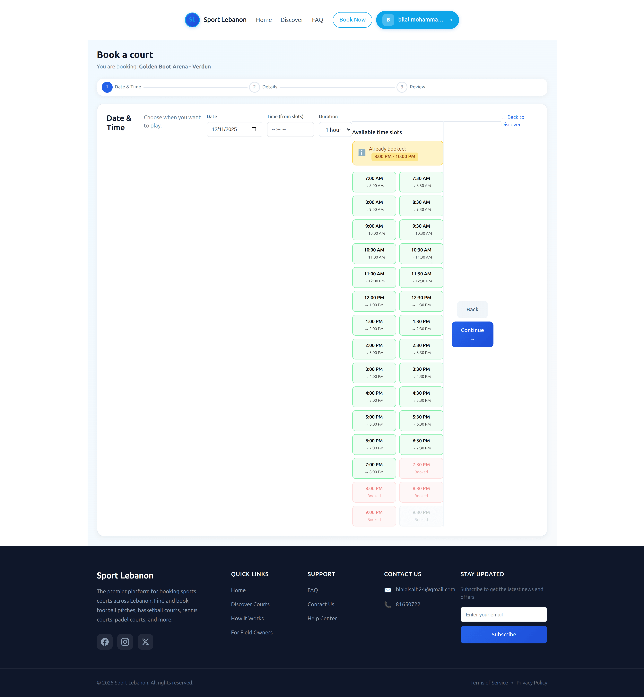
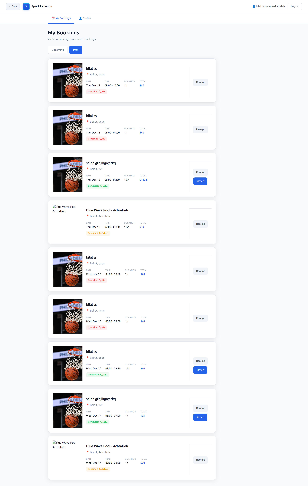
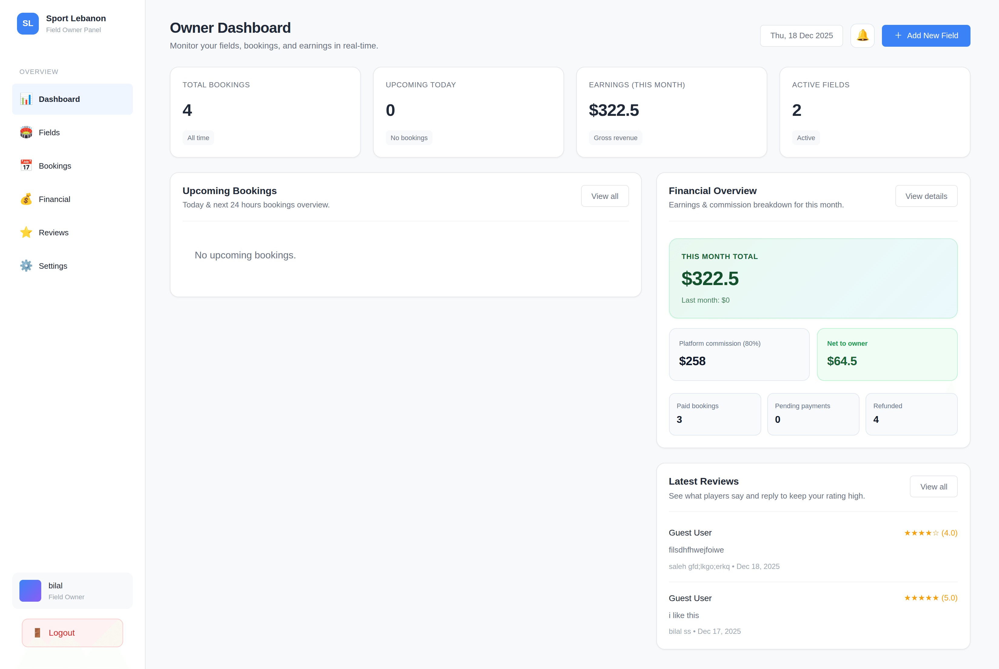
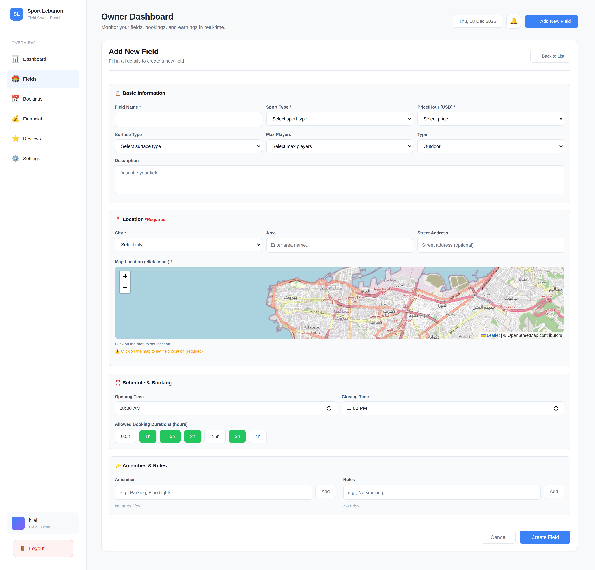
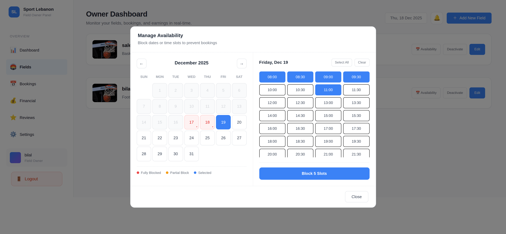
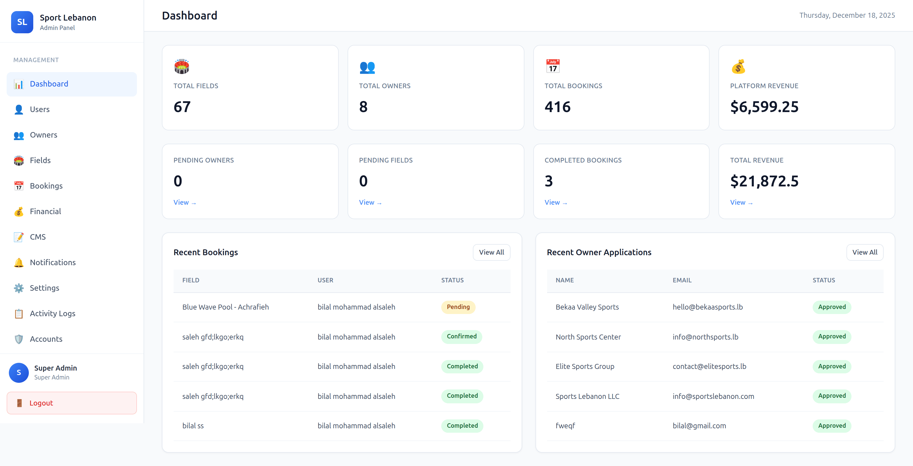
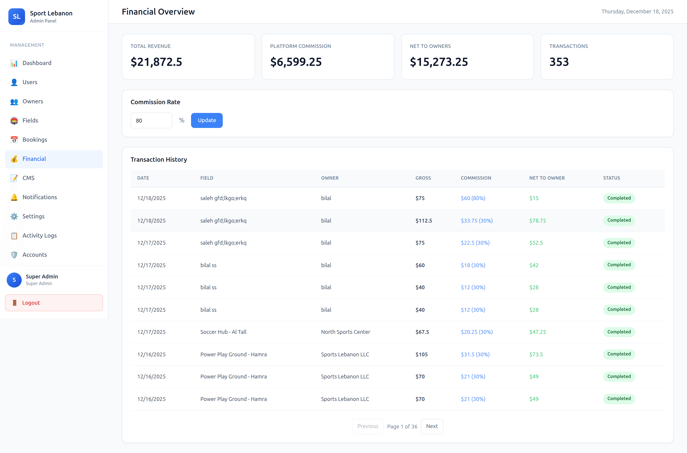
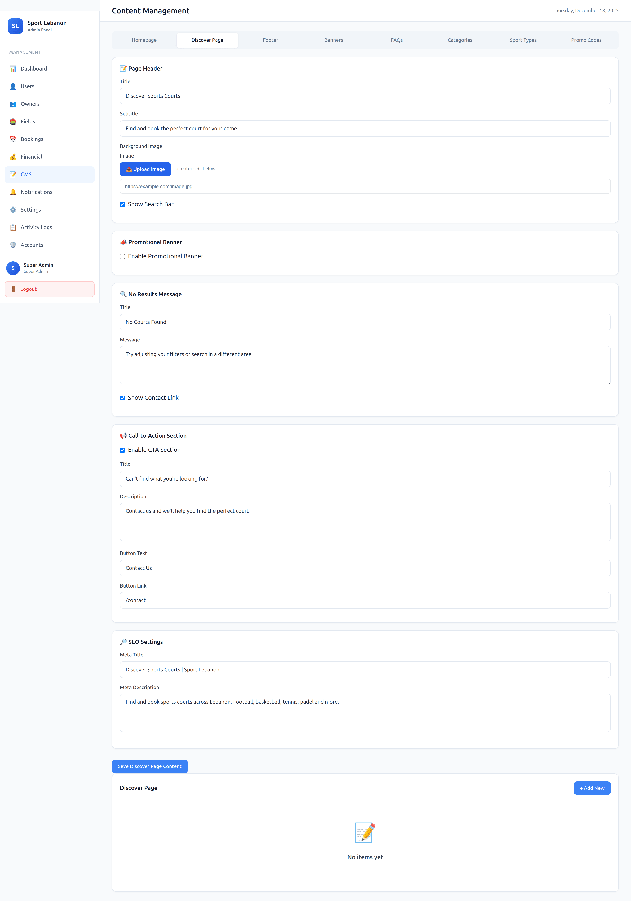

# Fields Booking Platform

A comprehensive full-stack web application for booking sports fields and courts across Lebanon. Built with the MERN stack, this platform enables users to discover, book, and manage sports field reservations while providing field owners with powerful management tools and administrators with complete control over the platform.

## Features

- **Multi-Role System**: Unified authentication supporting Users, Field Owners, and Administrators
- **Field Discovery**: Browse and search sports fields by sport type, location, city, and availability
- **Real-Time Booking**: Instant booking system with real-time availability checking
- **Owner Dashboard**: Complete field management interface for owners to add fields, manage bookings, view analytics, and handle finances
- **Admin Panel**: Comprehensive admin dashboard for managing users, owners, fields, bookings, platform settings, and CMS content
- **Dynamic CMS**: Admin-controlled content management for homepage, footer, banners, FAQs, and sport types
- **Financial Management**: Transaction tracking, revenue reports, and financial analytics for owners and admins
- **Booking Management**: Full booking lifecycle from creation to completion with status tracking
- **Availability System**: Flexible time slot management with hourly booking support
- **User Accounts**: Personal booking history, profile management, and review system
- **Responsive Design**: Modern, mobile-friendly UI built with React and Material-UI

## Tech Stack

### Frontend
- **React 19** - UI library
- **Vite** - Build tool and dev server
- **React Router DOM** - Client-side routing
- **Material-UI (MUI)** - Component library
- **Bootstrap 5** - Additional styling
- **Axios** - HTTP client
- **Chart.js** - Data visualization for dashboards

### Backend
- **Node.js** - Runtime environment
- **Express 5** - Web framework
- **MongoDB** - Database
- **Mongoose** - ODM for MongoDB
- **JWT** - Authentication tokens
- **bcryptjs** - Password hashing
- **Multer** - File upload handling

## Installation

### Prerequisites

- **Node.js** 20+ (22+ recommended)
- **MongoDB** (local installation or MongoDB Atlas)
- **npm** or **yarn** package manager

### Backend Setup

1. Navigate to the backend directory:
```bash
cd backend
```

2. Install dependencies:
```bash
npm install
```

3. Create a `.env` file in the `backend/` directory:
```env
MONGO_URI=your_mongodb_connection_string
JWT_SECRET=your_jwt_secret_key
PORT=5000
```

4. Seed initial data (optional but recommended):
```bash
node scripts/seedAdmin.js          # Creates super admin account
node scripts/seedSportTypes.js     # Creates initial sport types
node scripts/seedCMSContent.js     # Seeds CMS content
```

5. Start the development server:
```bash
npm run dev
```

The backend API will run on `http://localhost:5000`

### Frontend Setup

1. Navigate to the frontend directory:
```bash
cd frontend
```

2. Install dependencies:
```bash
npm install
```

3. Start the development server:
```bash
npm run dev
```

The frontend will run on `http://localhost:5173` (or next available port)

### Default Admin Credentials

After running `seedAdmin.js`, you can log in with:
- **Email**: `admin@sportlebanon.com`
- **Password**: `Admin123!`

⚠️ **Important**: Change the default password after first login!

## Usage Guide

### Running the Application

1. **Start MongoDB**: Ensure MongoDB is running locally or configure MongoDB Atlas connection string in `.env`

2. **Start Backend**: 
   ```bash
   cd backend
   npm run dev
   ```

3. **Start Frontend** (in a new terminal):
   ```bash
   cd frontend
   npm run dev
   ```

4. **Access the Application**: Open `http://localhost:5173` in your browser

### Using the Application

#### For Users
1. Browse available fields on the homepage or discover page
2. Search by sport type, city, or location
3. View field details including pricing, amenities, and availability
4. Create an account or log in to make bookings
5. Complete booking flow by selecting date, time slot, and duration
6. Manage bookings in your account dashboard

#### For Field Owners
1. Register as an owner through the owner registration flow
2. Wait for admin approval (if required)
3. Log in to access the owner dashboard
4. Add and manage your sports fields
5. Set availability schedules and pricing
6. View and manage bookings
7. Access financial reports and analytics

#### For Administrators
1. Log in with admin credentials
2. Access the admin dashboard
3. Manage users, owners, and fields
4. Oversee all bookings and transactions
5. Configure platform settings
6. Manage CMS content (homepage, footer, FAQs, banners)
7. View platform-wide analytics and reports

## Screenshots

### Homepage

*Landing page showcasing featured sports fields and platform overview*

### Discover Page

*Browse and search available sports fields by sport type, location, and filters*

### Booking Flow

*Step-by-step booking process for selecting date, time, and confirming reservation*

### Booking Confirmation

*Confirmation page after successful booking with booking details*

### User Dashboard

*User account dashboard showing booking history and profile management*

### Owner Dashboard

*Field owner dashboard with field management, bookings, and analytics*

### Add Field

*Interface for field owners to add new sports fields with details and images*

### Availability Management

*Time slot and availability management interface for field owners*

### Admin Dashboard

*Administrative dashboard with platform overview and management tools*

### Financial Reports

*Financial analytics and revenue reports for owners and administrators*

### CMS Editor

*Content management system for admins to edit homepage, footer, and platform content*

## Project Structure

```
fields-booking/
├── backend/
│   ├── config/
│   │   └── db.js                 # MongoDB connection configuration
│   ├── controllers/              # Route handlers and business logic
│   │   ├── adminAccountController.js
│   │   ├── adminActivityController.js
│   │   ├── adminAuthController.js
│   │   ├── adminBookingController.js
│   │   ├── adminCMSController.js
│   │   ├── adminDashboardController.js
│   │   ├── adminFieldController.js
│   │   ├── adminFinancialController.js
│   │   ├── adminNotificationController.js
│   │   ├── adminOwnerController.js
│   │   ├── adminSettingsController.js
│   │   ├── adminSportTypeController.js
│   │   ├── adminUserController.js
│   │   ├── availabilityController.js
│   │   ├── bookingController.js
│   │   ├── fieldAvailabilityController.js
│   │   ├── fieldController.js
│   │   ├── notificationController.js
│   │   ├── ownerBookingController.js
│   │   ├── ownerController.js
│   │   ├── ownerDashboardController.js
│   │   ├── ownerReviewController.js
│   │   ├── ownerSettingsController.js
│   │   ├── unifiedAuthController.js
│   │   └── userController.js
│   ├── middleware/               # Authentication and authorization
│   │   ├── adminAuth.js
│   │   ├── auth.js
│   │   ├── authorizeFieldOwner.js
│   │   └── userAuth.js
│   ├── models/                   # MongoDB schemas
│   │   ├── ActivityLog.js
│   │   ├── Admin.js
│   │   ├── Booking.js
│   │   ├── Category.js
│   │   ├── City.js
│   │   ├── CMSBanner.js
│   │   ├── DiscoverContent.js
│   │   ├── FAQ.js
│   │   ├── Field.js
│   │   ├── FooterContent.js
│   │   ├── HomepageContent.js
│   │   ├── Notification.js
│   │   ├── NotificationTemplate.js
│   │   ├── Owner.js
│   │   ├── PlatformSettings.js
│   │   ├── PromoCode.js
│   │   ├── SportType.js
│   │   ├── Transaction.js
│   │   └── User.js
│   ├── routes/                   # API route definitions
│   │   ├── adminRoutes.js
│   │   ├── authRoutes.js
│   │   ├── availabilityRoutes.js
│   │   ├── bookingRoutes.js
│   │   ├── fieldRoutes.js
│   │   ├── ownerRoutes.js
│   │   ├── publicRoutes.js
│   │   └── userRoutes.js
│   ├── scripts/                  # Database seeding scripts
│   │   ├── backfillTransactions.js
│   │   ├── migrateApprovalStatus.js
│   │   ├── normalizeBookings.js
│   │   ├── seedAdmin.js
│   │   ├── seedCMSContent.js
│   │   └── seedSportTypes.js
│   ├── utils/                    # Utility functions
│   │   ├── timeUtils.js
│   │   └── upload.js
│   ├── uploads/                  # Uploaded files storage
│   ├── server.js                 # Express server entry point
│   └── package.json
│
├── frontend/
│   ├── public/
│   │   └── screenshots/          # Application screenshots
│   ├── src/
│   │   ├── account/              # User account pages
│   │   │   ├── layout/
│   │   │   └── pages/
│   │   ├── admin/                # Admin panel
│   │   │   ├── components/
│   │   │   ├── layout/
│   │   │   └── pages/
│   │   ├── auth/                 # Authentication pages
│   │   │   └── pages/
│   │   ├── components/           # Reusable React components
│   │   │   ├── auth/
│   │   │   ├── layout/
│   │   │   └── search/
│   │   ├── constants/            # App constants
│   │   ├── contexts/             # React contexts (AuthContext)
│   │   ├── dashboard/            # Owner dashboard
│   │   │   ├── components/
│   │   │   └── layout/
│   │   ├── ownerAuth/            # Owner authentication
│   │   ├── pages/                # Public pages
│   │   │   ├── BookingFlow.jsx
│   │   │   ├── BookingSuccess.jsx
│   │   │   ├── Discover.jsx
│   │   │   ├── FAQ.jsx
│   │   │   ├── FieldDetails.jsx
│   │   │   └── Home.jsx
│   │   ├── userAuth/             # User authentication
│   │   ├── App.jsx               # Main app component
│   │   ├── main.jsx              # React entry point
│   │   └── index.css
│   ├── vite.config.js
│   └── package.json
│
└── README.md
```

## API Endpoints

### Authentication
- `POST /api/auth/login` - Unified login for all roles
- `GET /api/auth/me` - Get current authenticated user

### Public Routes
- `GET /api/public/sport-types` - Get active sport types
- `GET /api/public/cities` - Get cities with areas
- `GET /api/public/homepage` - Get homepage content
- `GET /api/public/footer` - Get footer content
- `GET /api/public/faqs` - Get FAQ content

### Fields
- `GET /api/fields` - List all fields (with filters)
- `GET /api/fields/:id` - Get field details
- `GET /api/fields/:id/availability` - Get field availability

### Bookings
- `POST /api/bookings` - Create new booking
- `GET /api/bookings` - Get user bookings
- `PUT /api/bookings/:id` - Update booking
- `DELETE /api/bookings/:id` - Cancel booking

### Owner Routes
- `GET /api/owner/dashboard` - Owner dashboard data
- `POST /api/owner/fields` - Create new field
- `GET /api/owner/bookings` - Get owner's field bookings
- `GET /api/owner/financial` - Financial reports

### Admin Routes
- `GET /api/admin/dashboard` - Admin dashboard data
- `GET /api/admin/users` - Manage users
- `GET /api/admin/owners` - Manage owners
- `GET /api/admin/fields` - Manage all fields
- `GET /api/admin/bookings` - Manage all bookings
- `GET /api/admin/cms/*` - CMS content management
- `GET /api/admin/financial` - Platform financial data

## Troubleshooting

### Port Already in Use
If port 5173 is in use, Vite will automatically try the next available port (5174, 5175, etc.). Similarly, if port 5000 is in use for the backend, change it in the `.env` file.

### Node Version Issues
Use Node.js 20+ or 22+. If using nvm:
```bash
nvm use 22
```

### MongoDB Connection Issues
- Verify `MONGO_URI` in `.env` is correct
- Ensure MongoDB is running (if using local instance)
- Check network connectivity (if using MongoDB Atlas)
- Verify database user permissions

### CORS Errors
Ensure backend CORS is configured to allow frontend origin. The backend should allow requests from `http://localhost:5173`.

### Authentication Issues
- Check `JWT_SECRET` matches in backend `.env`
- Verify token is stored correctly in localStorage
- Check `/api/auth/me` endpoint returns correct user data
- Clear browser localStorage and try logging in again

### File Upload Issues
- Ensure `uploads/` directory exists in backend folder
- Check file size limits in multer configuration
- Verify file permissions on uploads directory

## Development

### Running Both Servers Simultaneously

You can use `concurrently` to run both servers:

```bash
npm install -g concurrently
concurrently "cd backend && npm run dev" "cd frontend && npm run dev"
```

Or create a root `package.json`:
```json
{
  "scripts": {
    "dev": "concurrently \"cd backend && npm run dev\" \"cd frontend && npm run dev\""
  },
  "devDependencies": {
    "concurrently": "^8.2.2"
  }
}
```

### Building for Production

**Frontend:**
```bash
cd frontend
npm run build
```

The production build will be in `frontend/dist/`

**Backend:**
```bash
cd backend
npm start
```

## License

Private project - All rights reserved

---

**Author**: Bilal Al Saleh
